# 9. Wireframe

# PhoneVentures App – Wireframes

In dit document worden de wireframes getoond die zijn gemaakt op basis van de user stories. Elk wireframe geeft een visuele weergave van de functionaliteiten die belangrijk zijn voor de gebruikers van de app. Onder elk wireframe staat een korte uitleg van wat er te zien is.

---

## Product Registreren

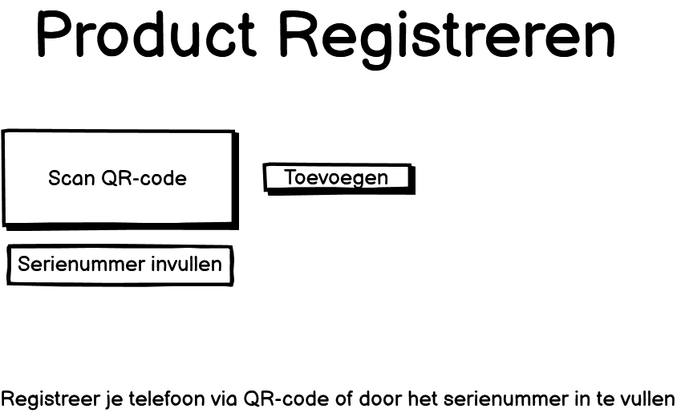
 
In dit scherm kan een klant zijn smartphone registreren. Bovenaan staat een knop om een QR-code te scannen, en daaronder is er een veld om handmatig het serienummer in te vullen. Als de registratie is gelukt, verschijnt het toestel in het overzicht onderaan.

---

## Garantie Melding

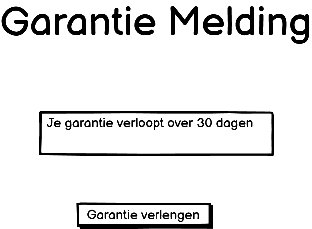
 
De klant krijgt een melding te zien als de garantie bijna afloopt. In dit scherm zie je de melding met informatie over hoeveel dagen er nog over zijn. Er is ook een knop waarmee de klant meteen de garantie kan verlengen via de app.

---

## Handleidingen en Video’s Bekijken

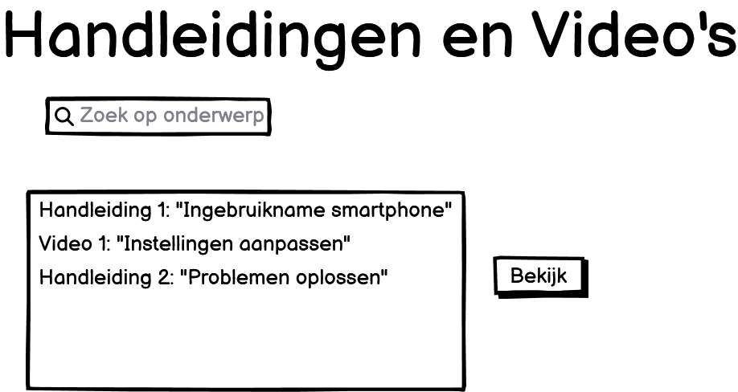
 
Hier kan de klant handleidingen en instructievideo’s vinden. Bovenaan staat een zoekbalk waarmee je op onderwerp kunt zoeken. Daaronder staan een aantal voorbeeldhandleidingen met titels en een korte beschrijving. De klant kan erop klikken om ze te openen.

---

## Chatten met Klantenservice

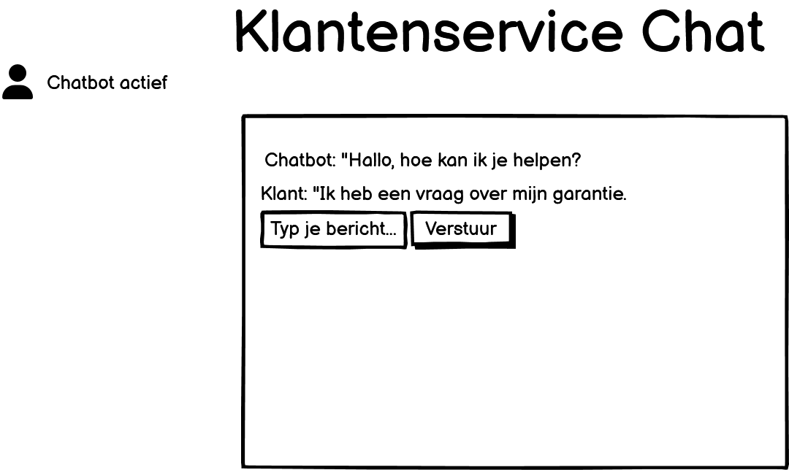

In dit scherm begint de klant met een chatbot. De chatbot stelt eerst een paar vragen. Als het antwoord niet duidelijk genoeg is, kan de klant doorgeschakeld worden naar een echte medewerker. De chatfunctie is alleen beschikbaar als het kantoor open is.

---

##  Reparatie Melden

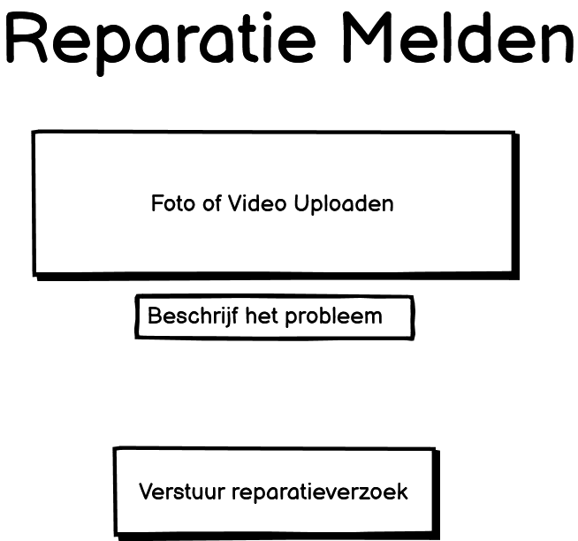

De klant kan hier een reparatie melden. Er is een veld om te typen wat er mis is, en daaronder knoppen om een foto of video toe te voegen. Als de aanvraag is verstuurd, krijgt de klant via meldingen updates over de voortgang van de reparatie.

---

## Reparatieverzoeken Beheren (Voor Medewerkers)

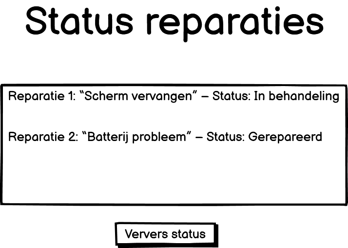
 
Dit scherm is voor klantenservicemedewerkers. Hier zie je een lijst met alle reparatieverzoeken, inclusief de naam van de klant, het toestel, de omschrijving van het probleem en de status (bijv. “Nieuw” of “In behandeling”). Er is ook een knop om contact op te nemen met de klant of een opmerking toe te voegen.

---

## Content Beheren (Voor Beheerders)

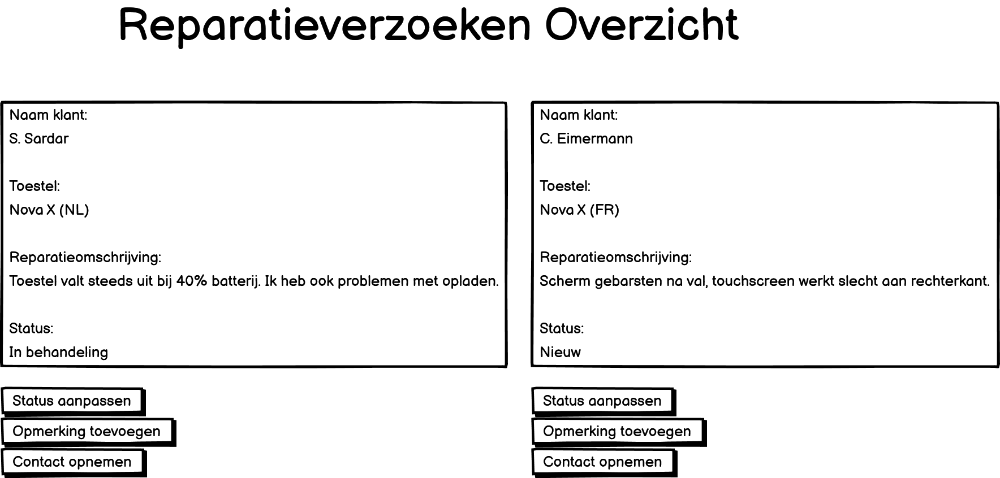
  
In dit scherm kunnen beheerders handleidingen, video’s en veelgestelde vragen beheren. Ze kunnen hier nieuwe content toevoegen door bestanden te uploaden, titels en zoekwoorden in te voeren en bestaande informatie te bewerken of verwijderen. Alles staat netjes in een overzicht.

---

## Promoties Instellen (Voor Marketing)

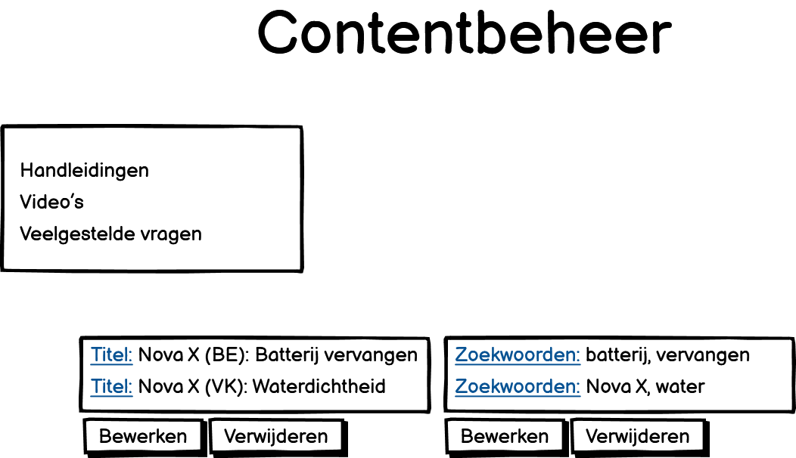
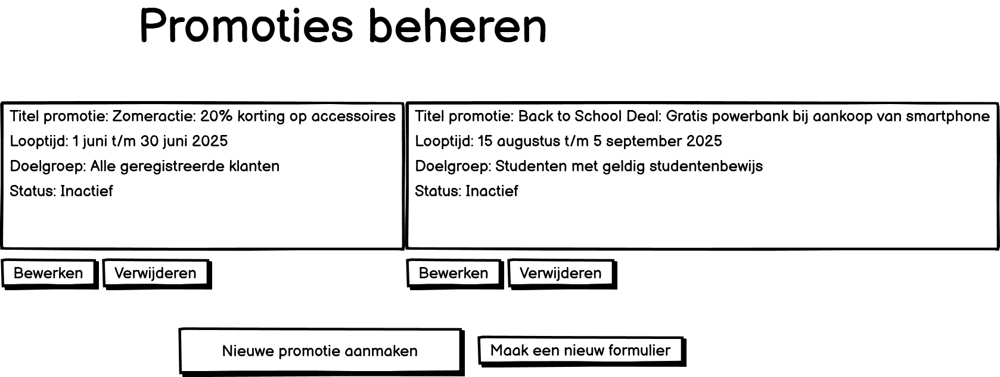
 
Dit scherm is voor de marketingafdeling. Er is een formulier waarmee ze een nieuwe promotie kunnen aanmaken. Ze kunnen een titel invullen, een afbeelding toevoegen, een geldigheidsduur kiezen en een doelgroep selecteren. Actieve promoties worden weergegeven in een lijstje onderaan.

---

## Bugs en Feedback Monitoren (Voor Ontwikkelaars)

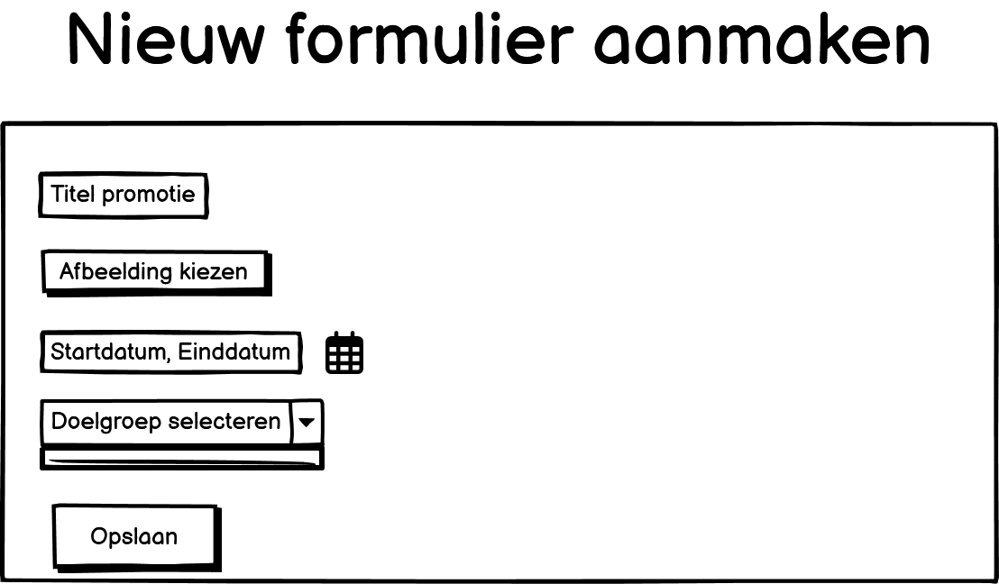
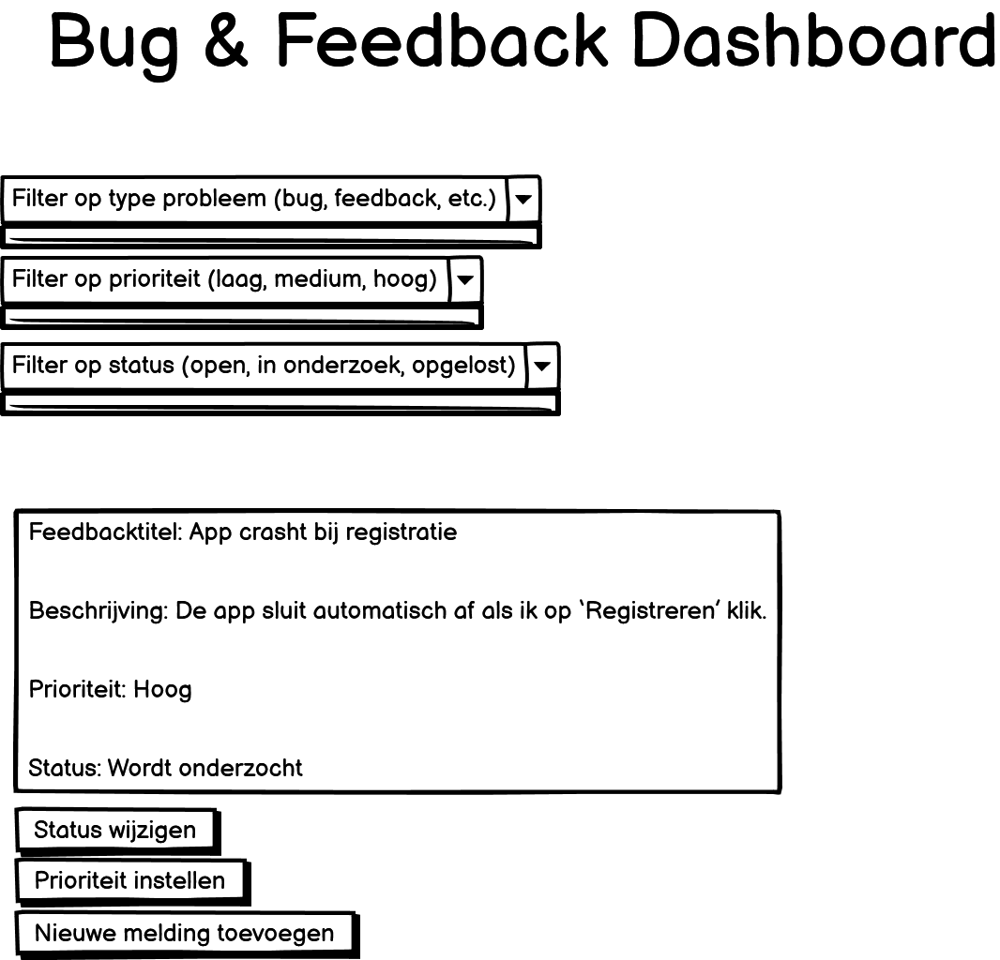
  
In dit dashboard zien ontwikkelaars alle bugs en feedback die zijn ingediend door klanten. Ze kunnen filteren op type probleem, de prioriteit aanpassen en de status bijhouden zoals “Opgelost” of “In onderzoek”. Dit helpt om technische problemen sneller aan te pakken.

---

