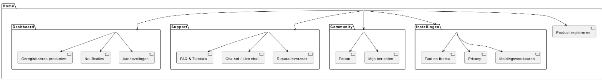

# 8. Sitemap

De sitemap toont de navigatiestructuur van een digitale omgeving, bijvoorbeeld een website of applicatie. Het hoofdmenu bestaat uit vijf hoofdcategorieën: Dashboard, Support, Community, Instellingen en Product registreren. Elke hoofdcategorie bevat één of meerdere subpagina’s die logisch zijn gegroepeerd op basis van functie en gebruiksgemak.

- **Dashboard** bevat persoonlijke informatie zoals geregistreerde producten, meldingen en aanbevelingen.
- **Support** biedt ondersteuning via een FAQ, tutorials, een chatbot of live chat en de mogelijkheid om een reparatieverzoek in te dienen.
- **Community** geeft toegang tot een forum en persoonlijke berichten, waar gebruikers met elkaar kunnen communiceren.
- **Instellingen** bevat opties om de taal, het thema en privacy- of meldingsvoorkeuren aan te passen.
- **Product registreren** is een afzonderlijke functie die direct vanuit het hoofdmenu te benaderen is.

Deze structuur zorgt ervoor dat gebruikers snel de juiste informatie of functie kunnen vinden. De visuele opzet maakt duidelijk hoe de verschillende onderdelen met elkaar samenhangen en draagt bij aan een gebruiksvriendelijke interface.
