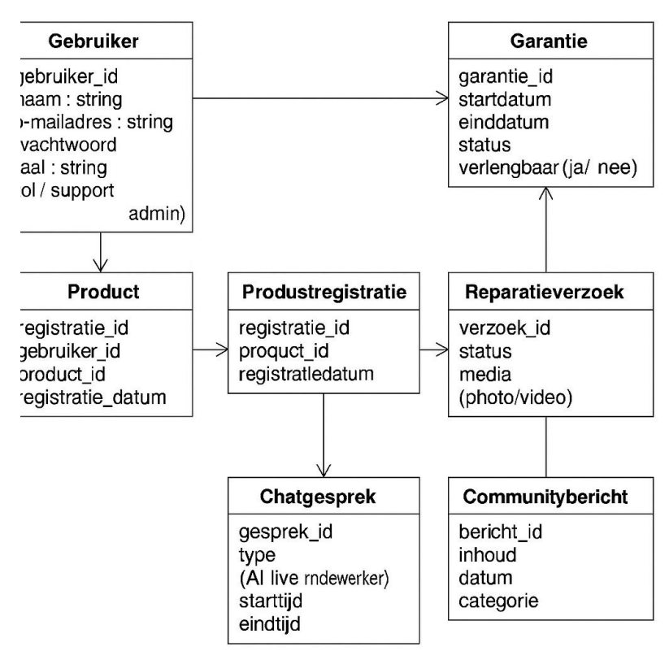

---

# 9. Wireframe

## Telefoon registreren

De afbeelding laat een webpagina zien die gebruikt wordt om een telefoon te registreren via een QR-code of via een handmatige invoer.

**Bovenkant van de pagina**  
Helemaal bovenaan zie je een logo met de tekst "Telefoon registratie". Rechts daarvan staat een menu met drie opties: Home, Scan QR Code en Handmatig invoeren. De optie Scan QR Code is groen gekleurd, dus dat is de pagina waar je op dat moment bent.

**Midden van de pagina**  
Er staat een koptekst die uitlegt dat je de QR-code op je product moet scannen met je telefoon. Op die manier voeg je het product toe aan je account. Daaronder staat een afbeelding van een telefoon die een QR-code scant.

**Onder het midden**  
Er verschijnt een melding dat de telefoon succesvol is geregistreerd. Dat betekent dat het toestel goed is toegevoegd aan je account. Je ziet ook een foto van het product, met daaronder de gegevens:
- Productnaam: Telefoon
- Model: 1
- Serienummer: 11111122222

**Onderaan de pagina**  
In de groene balk onderaan staat contactinformatie, zoals het e-mailadres `support@productregistration.com` en het telefoonnummer `+1234 567 890`. Aan de rechterkant vind je links naar de privacyverklaring en de algemene voorwaarden.

---

## Reparatieverzoek

De afbeelding laat een webpagina zien waar je een reparatieverzoek kunt indienen.

**Bovenkant van de pagina**  
Linksboven staat het logo met de tekst "Reparatie". Rechtsboven in het menu zie je drie opties:
- Reparatieverzoek indienen
- Reparatiestatus
- Instellingen

De gebruiker is op dit moment op de pagina "Reparatieverzoek indienen".

**Midden van de pagina**  
In het midden van de pagina staat een formulier waar je informatie kunt invullen. Het formulier bestaat uit drie delen:
1. **Beschrijf het probleem**: Hier kun je uitleggen wat er mis is met het apparaat of product.
2. **Upload een foto of video**: Je kunt hier een afbeelding of filmpje toevoegen van het probleem, zodat de reparatiedienst een beter beeld krijgt.
3. **Uw contactgegevens**: Hier vul je je e-mailadres of telefoonnummer in, zodat het bedrijf contact met je kan opnemen.

Onder het formulier staat een knop met de tekst "Verzoek indienen". Deze knop gebruik je om het formulier te versturen.

**Onderaan de pagina**  
Onder het formulier verschijnt een groene melding. In deze melding staat dat het reparatieverzoek succesvol is verstuurd. Het bedrijf laat weten dat ze binnenkort contact opnemen met de klant.

