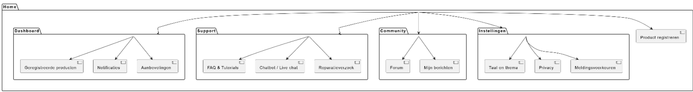
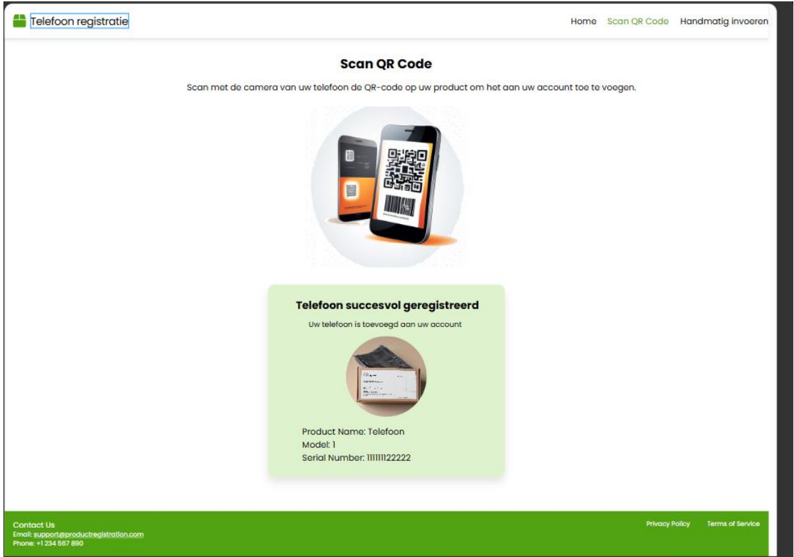
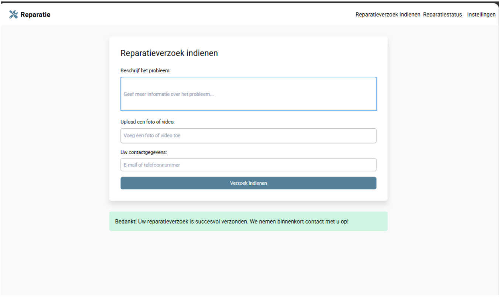
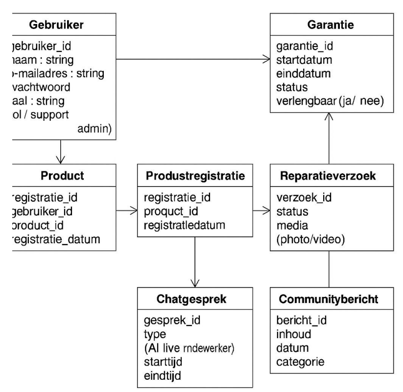

# Requirement Specificatie

## Telenova
**Clemens Eimermann**  
**Samir Sardar**  
**Usama Husnain**  
**Zakaria Ouzlig**  
**Rayaan Hohoud**

| Versienummer | Datum       | Auteur   | Wijziging                                                                 | Gecontroleerd |
|--------------|-------------|----------|---------------------------------------------------------------------------|---------------|
| **0.1**      | 11-04-2025  | Samir    | Document aangemaakt + Organisatorische Context, Actoren en Bedrijfsprocesanalyse gemaakt | Clemens       |
| **0.2**      | 11-04-2025  | Clemens  | Productvisie en user stories gemaakt                                      | Zakaria       |
| **0.3**      | 11-04-2025  | Rayaan   | Domeinmodel, UML klassendiagram, Sitemap en Wireframes toegevoegd, Domeinmodel verbeterd | Usama         |

## Inhoud
1. **Organisatorische Context**  
2. **Actoren**  
3. **Bedrijfsprocesanalyse**  
4. **Productvisie (Product Vision Board)**  
5. **User Stories voor de Phoneventures App**  
6. **Domeinmodel**  
7. **UML Klassendiagram**  
8. **Sitemap**  
9. **Wireframe**

---

# Requirements Specificatie

## 1. Organisatorische Context

### Missie
PhoneVentures wil de klanttevredenheid en klantloyaliteit verbeteren door digitale middelen te gebruiken.

### Visie
Het doel is om een gebruiksvriendelijke digitale omgeving te maken voor mensen die een smartphone hebben.

### Strategie
Door middel van een app wil PhoneVentures de klantenservice beter maken, meer producten verkopen en klanten beter bereiken via marketing.

### Doelstellingen
- Klanten moeten meer tevreden zijn  
- Klanten blijven langer bij het bedrijf  
- De klantenservice werkt efficiënter  
- Meer verkoop van extra producten zoals accessoires  

### Stakeholders
- Klanten van PhoneVentures  
- Medewerkers van de klantenservice  
- Het marketingteam  
- Ontwikkelaars / IT-afdeling  
- Het management van PhoneVentures  

---

## 2. Actoren

- **Klant**: Kan producten registreren, handleidingen bekijken, vragen stellen en notificaties ontvangen via de app.  
- **Klantenservice**: Helpt klanten bij vragen of problemen.  
- **Technisch team**: Zorgt voor updates en lost technische problemen op.  
- **Marketing**: Stuurt acties, aanbiedingen en promoties.  
- **Beheerder**: Zorgt ervoor dat het systeem goed blijft werken en beheert de inhoud.  

---

## 3. Bedrijfsprocesanalyse

Bij PhoneVentures gaat het proces nu nog best ouderwets. Als klanten hulp nodig hebben, moeten ze meestal bellen of mailen. Dit zorgt voor lange wachttijden en frustraties.  

Met de nieuwe app willen we dit veranderen. Klanten moeten straks makkelijk via de app:
- hun producten kunnen registreren,  
- handleidingen kunnen lezen,  
- problemen melden,  
- en updates krijgen.  

### Huidige situatie (IST)
- Klanten nemen contact op via telefoon of e-mail  
- Veel tijd nodig om simpele vragen te beantwoorden  
- Klanten moeten zelf uitzoeken wat ze moeten doen  

### Gewenste situatie (SOLL)
- Klanten regelen alles zelf via de app  
- Minder druk op de klantenservice  
- Meer overzicht en gemak voor de klant  

### Problemen / Knelpunten
- Wachttijden zijn lang  
- Niet alle informatie is makkelijk vindbaar  
- Er zijn veel losse systemen in gebruik  

### Wat er nodig is (GAP)
- Alles centraliseren in één app  
- Selfservice toevoegen  
- Beter overzicht voor klant en medewerkers  

### SIPOC – Overzicht van het klantondersteuningsproces via de app

| **S**uppliers         | **I**nputs                                      | **P**rocessen                                                       | **O**utputs                                | **C**ustomers             |
|-----------------------|-------------------------------------------------|----------------------------------------------------------------------|---------------------------------------------|----------------------------|
| Ontwikkelteam         | Klantgegevens, productinformatie                | Klant registreert product in de app                                  | Product gekoppeld aan klantprofiel          | Klant                      |
| Klantenservice        | FAQ's, supportdata                              | Klant stelt vraag of meldt probleem via de app                       | Automatische of directe ondersteuning       | Klant                      |
| IT-afdeling           | Systeemupdates, technische ondersteuning        | App verwerkt meldingen en verstuurt notificaties                    | Up-to-date en werkende app                  | Klant en medewerkers       |
| Marketingafdeling     | Promoties, acties, communicatiecontent          | App toont promoties en gepersonaliseerde aanbiedingen                | Verhoogde klantbetrokkenheid                | Klant                      |
| Beheerder             | Inhoud, gebruikersbeheer                        | Systeembeheer en monitoring                                          | Stabiele en functionele omgeving            | Alle gebruikers van de app |

---

## 4. Productvisie

## Visie
**Waarom maken we deze app?**  
We maken deze app zodat klanten van PhoneVentures alles op één plek makkelijk en goed kunnen regelen voor hun smartphones of andere producten.

**Wat willen we hiermee bereiken?**  
We willen het klanten eenvoudiger maken om zelf dingen te regelen. Dat zorgt voor minder gedoe en meer tevreden klanten.

## Doelgroep
**Welke markt of marktsegment spreken we aan?**  
Deze app is voor de mensen die smartphones of andere producten hebben gekocht bij een bedrijf van PhoneVentures.

**Wat zijn de doelgroepen en gebruikers?**  
De gebruikers zijn de klanten van PhoneVentures. Dit zijn mensen van alle leeftijden en met allerlei soorten opleidingen.

## Behoeften
**Welk probleem lost de app op of welke voordelen biedt het?**  
- Klanten kunnen snel alles vinden over hun smartphones of andere producten.  
- Klanten kunnen zelf dingen regelen zoals garantie aanvragen of updates uitvoeren.  
- De app zorgt ervoor dat klanten sneller geholpen worden en dat alles gemakkelijker gaat.

## Product
**Wat voor product is het?**  
De app is een mobiele applicatie waarmee klanten van PhoneVentures alles over hun smartphones en andere producten makkelijk kunnen regelen.

**Wat zijn de belangrijkste kenmerken die het anders maken dan andere apps?**  
- Alles op één plek  
- Zelfservicefunctionaliteit  
- Een grote community

**Is het haalbaar om de app te maken?**  
Ja, het is zeker haalbaar om de app te maken. De technologieën zijn er om de app goed en snel te ontwikkelen.

## Zakelijke doelstellingen
**Wat levert de app op voor het bedrijf dat hem maakt? Wat zijn de voordelen voor het bedrijf?**  
- Meer tevreden klanten  
- Minder druk op de klantenservice  
- Meer verkopen  
- Betere beslissingen op basis van klantgegevens

## Concurrenten
- **Samsung Members App**  
  *Voordeel:* Veel functionaliteit  
  *Nadeel:* Alleen handig voor mensen met een Samsung

- **Apple Support App**  
  *Voordeel:* Snelle hulp met duidelijke uitleg  
  *Nadeel:* Alleen geschikt voor mensen met Apple-producten

## Inkomststromen
Hoe kan de app geld verdienen voor het bedrijf?  
1. Verkoop van spullen in de app  
2. Betaalde garantie of verzekering instellen  
3. Speciale kortingen aanbieden die alleen in de app beschikbaar zijn  
4. Reclame van andere merken of bedrijven tonen in de app

## Kosten van de app
Wat kost geld om de app te maken en goed te laten werken?  
- De app ontwikkelen  
- De app onderhouden  
- Klantenservice  
- Reclamecampagnes  
- Softwarelicenties

## Bekendmaking
**Hoe gaan we de app bekendmaken en laten downloaden?**  
- Promotie via sociale media  
- Klanten worden na aankoop automatisch doorverwezen naar de app  
- Zo kunnen klanten de app direct gebruiken, wat zorgt voor snelle en brede verspreiding.

---

## 5. User Stories voor de Phoneventures App

## User Stories voor de Phoneventures App

1. **Product registreren**  
   Als gebruiker wil ik mijn smartphone makkelijk kunnen toevoegen in de app, zodat ik informatie en garantie van het product kan zien.

2. **Dashboard met mijn producten**  
   Als gebruiker wil ik een overzicht van mijn apparaten in de app, zodat ik snel kan zien welke ik heb toegevoegd.

3. **Melding als garantie bijna afloopt**  
   Als gebruiker wil ik een bericht krijgen als de garantie bijna afgelopen is, zodat ik op tijd actie kan ondernemen.

4. **Melding bij updates**  
   Als gebruiker wil ik een melding krijgen als er een update is voor mijn apparaat, zodat ik mijn apparaat up-to-date kan houden.

5. **Reparatie aanvragen**  
   Als gebruiker wil ik een probleem kunnen melden en mijn reparatie volgen, zodat ik weet wat de status is van mijn toestel.

6. **Persoonlijke aanbiedingen en tips**  
   Als gebruiker wil ik aanbiedingen en tips zien die passen bij mijn producten, zodat ik dingen zie die voor mij interessant zijn.

7. **Winkel zoeken en afspraak maken**  
   Als gebruiker wil ik makkelijk een winkel vinden en een afspraak maken, zodat ik snel geholpen kan worden.

8. **Instellingen voor privacy en meldingen**  
   Als gebruiker wil ik zelf kunnen instellen wat de app over mij weet en stuurt, zodat ik controle heb over mijn gegevens.

---

## 6. Domeinmodel

In het diagram zie je hoe gebruikers hun producten kunnen registreren en beheren.
Een gebruiker kan meerdere producten hebben. Bij elk product horen gegevens zoals garantie, aankoopinformatie, handleidingen en software-updates.
Gebruikers kunnen meldingen krijgen, een reparatie aanvragen of een chat starten voor hulp. Ook kunnen ze berichten plaatsen in de community.
Verder kan de gebruiker zijn voorkeuren instellen, zoals taal en privacy.
Alles is verbonden met duidelijke relaties (0, 1 of meerdere).

---

# 7. UML Klassendiagram

Het UML-klassendiagram laat zien hoe de verschillende onderdelen van de mobiele app van PhoneVentures met elkaar samenwerken. Je ziet welke gegevens er in het systeem staan en hoe die onderdelen met elkaar verbonden zijn. Het diagram geeft een duidelijk overzicht van:
- **Gebruikersbeheer** – bijvoorbeeld wie de gebruiker is, welke rol hij heeft en hoe hij inlogt.
- **Productregistratie** – welke producten een gebruiker heeft en wanneer ze zijn geregistreerd.
- **Chatgesprekken** – contact tussen gebruikers en medewerkers of een chatbot.
- **Reparatieverzoeken** – aanvragen voor hulp bij een kapot product.
- **Garantie-informatie** – of een product nog garantie heeft en of die verlengd kan worden.
- **Communityberichten** – berichten die gebruikers plaatsen om tips of vragen te delen.

Door dit diagram wordt het makkelijker om te begrijpen hoe de onderdelen van de app samenwerken. Zo moet een gebruiker bijvoorbeeld eerst een product registreren voordat hij een reparatieverzoek kan indienen. Ook zie je dat elke stap in het proces wordt vastgelegd in het systeem.

### Gebruiker
Dit is de persoon die het systeem gebruikt. Bijvoorbeeld een klant of een medewerker. Er staat informatie bij zoals:
- `gebruiker_id`: een uniek nummer voor de gebruiker
- `naam`: de naam van de gebruiker
- `e-mailadres`
- `wachtwoord`
- `taal`: de taal waarin de gebruiker het systeem wil gebruiken
- `rol`: of de gebruiker bijvoorbeeld klant of medewerker (support of admin) is

### Product
Dit zijn de spullen die een gebruiker heeft gekocht. Bij elk product staat:
- `registratie_id`: uniek nummer voor de registratie
- `gebruiker_id`: wie het product heeft gekocht
- `product_id`: welk product het is
- `registratie_datum`: wanneer het product is geregistreerd

### Productregistratie
Hier staat wanneer een product is aangemeld bij het systeem.
- `registratie_id`
- `product_id`
- `registratiedatum`

### Chatgesprek
Als een gebruiker contact opneemt met een medewerker of met een chatbot, komt dat hier te staan.
- `gesprek_id`
- `type`: bijvoorbeeld AI of een echte medewerker
- `starttijd` en `eindtijd`: wanneer het gesprek begon en eindigde

### Garantie
Dit geeft aan of het product garantie heeft.
- `garantie_id`
- `startdatum` en `einddatum`
- `status`: bijvoorbeeld actief of verlopen
- `verlengbaar`: kan de garantie verlengd worden? (ja of nee)

### Reparatieverzoek
Als een product kapot is, kan de gebruiker een reparatie aanvragen.
- `verzoek_id`
- `status`: bijvoorbeeld in behandeling of opgelost
- `media`: de gebruiker kan foto’s of video’s meesturen

### Communitybericht
Gebruikers kunnen berichten plaatsen in de community, bijvoorbeeld een vraag of een tip.
- `bericht_id`
- `inhoud`: de tekst van het bericht
- `datum`
- `categorie`: waar het bericht over gaat

### Hoe alles samenwerkt:
- Een gebruiker registreert een product
- Dat product krijgt een productregistratie
- De gebruiker kan via een chatgesprek hulp vragen
- Er kan ook een reparatieverzoek worden ingediend
- Voor dat verzoek kan er een garantie gelden
- En gebruikers kunnen ook actief zijn in de community

---

# 8. Sitemap

De sitemap toont de navigatiestructuur van een digitale omgeving, bijvoorbeeld een website of applicatie. Het hoofdmenu bestaat uit vijf hoofdcategorieën: Dashboard, Support, Community, Instellingen en Product registreren. Elke hoofdcategorie bevat één of meerdere subpagina’s die logisch zijn gegroepeerd op basis van functie en gebruiksgemak.

- **Dashboard** bevat persoonlijke informatie zoals geregistreerde producten, meldingen en aanbevelingen.
- **Support** biedt ondersteuning via een FAQ, tutorials, een chatbot of live chat en de mogelijkheid om een reparatieverzoek in te dienen.
- **Community** geeft toegang tot een forum en persoonlijke berichten, waar gebruikers met elkaar kunnen communiceren.
- **Instellingen** bevat opties om de taal, het thema en privacy- of meldingsvoorkeuren aan te passen.
- **Product registreren** is een afzonderlijke functie die direct vanuit het hoofdmenu te benaderen is.

Deze structuur zorgt ervoor dat gebruikers snel de juiste informatie of functie kunnen vinden. De visuele opzet maakt duidelijk hoe de verschillende onderdelen met elkaar samenhangen en draagt bij aan een gebruiksvriendelijke interface.

---

# 9. Wireframe

## Telefoon registreren

De afbeelding laat een webpagina zien die gebruikt wordt om een telefoon te registreren via een QR-code of via een handmatige invoer.

**Bovenkant van de pagina**  
Helemaal bovenaan zie je een logo met de tekst "Telefoon registratie". Rechts daarvan staat een menu met drie opties: Home, Scan QR Code en Handmatig invoeren. De optie Scan QR Code is groen gekleurd, dus dat is de pagina waar je op dat moment bent.

**Midden van de pagina**  
Er staat een koptekst die uitlegt dat je de QR-code op je product moet scannen met je telefoon. Op die manier voeg je het product toe aan je account. Daaronder staat een afbeelding van een telefoon die een QR-code scant.

**Onder het midden**  
Er verschijnt een melding dat de telefoon succesvol is geregistreerd. Dat betekent dat het toestel goed is toegevoegd aan je account. Je ziet ook een foto van het product, met daaronder de gegevens:
- Productnaam: Telefoon
- Model: 1
- Serienummer: 11111122222

**Onderaan de pagina**  
In de groene balk onderaan staat contactinformatie, zoals het e-mailadres `support@productregistration.com` en het telefoonnummer `+1234 567 890`. Aan de rechterkant vind je links naar de privacyverklaring en de algemene voorwaarden.

---

## Reparatieverzoek

De afbeelding laat een webpagina zien waar je een reparatieverzoek kunt indienen.

**Bovenkant van de pagina**  
Linksboven staat het logo met de tekst "Reparatie". Rechtsboven in het menu zie je drie opties:
- Reparatieverzoek indienen
- Reparatiestatus
- Instellingen

De gebruiker is op dit moment op de pagina "Reparatieverzoek indienen".

**Midden van de pagina**  
In het midden van de pagina staat een formulier waar je informatie kunt invullen. Het formulier bestaat uit drie delen:
1. **Beschrijf het probleem**: Hier kun je uitleggen wat er mis is met het apparaat of product.
2. **Upload een foto of video**: Je kunt hier een afbeelding of filmpje toevoegen van het probleem, zodat de reparatiedienst een beter beeld krijgt.
3. **Uw contactgegevens**: Hier vul je je e-mailadres of telefoonnummer in, zodat het bedrijf contact met je kan opnemen.

Onder het formulier staat een knop met de tekst "Verzoek indienen". Deze knop gebruik je om het formulier te versturen.

**Onderaan de pagina**  
Onder het formulier verschijnt een groene melding. In deze melding staat dat het reparatieverzoek succesvol is verstuurd. Het bedrijf laat weten dat ze binnenkort contact opnemen met de klant.

