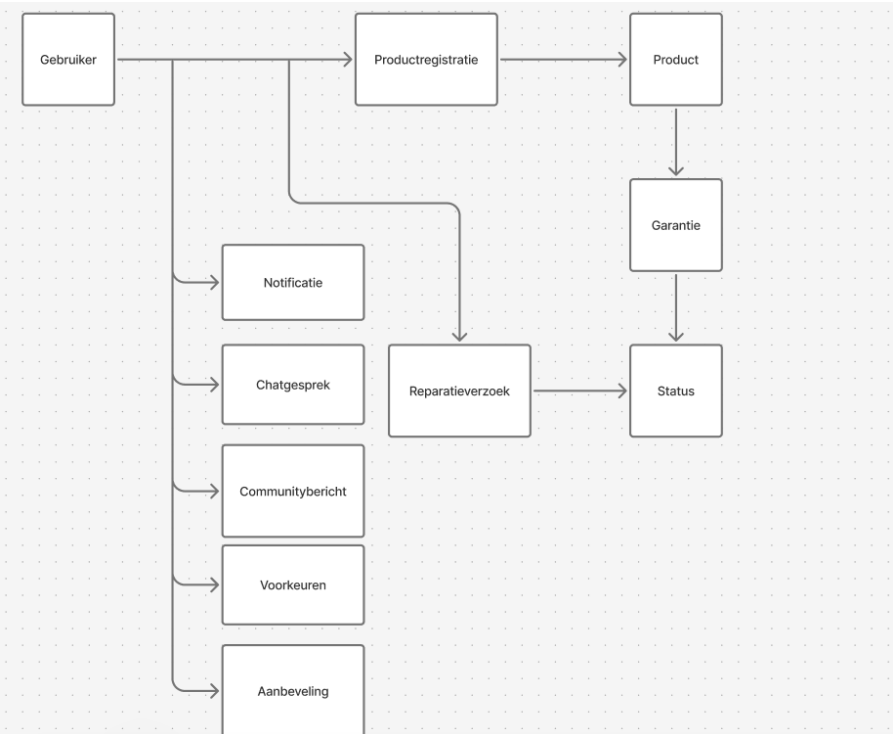
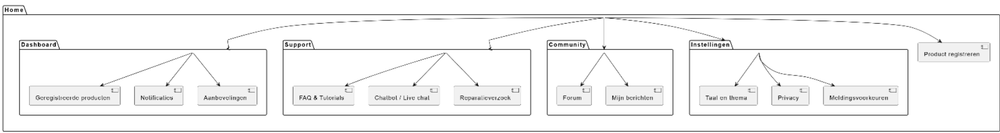
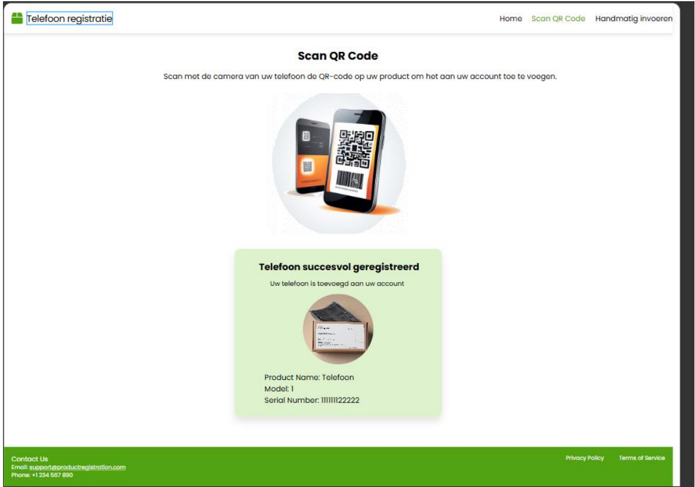
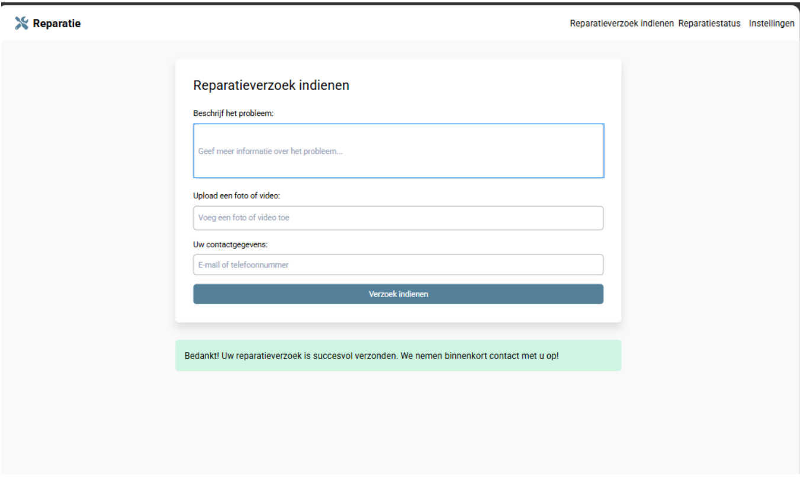
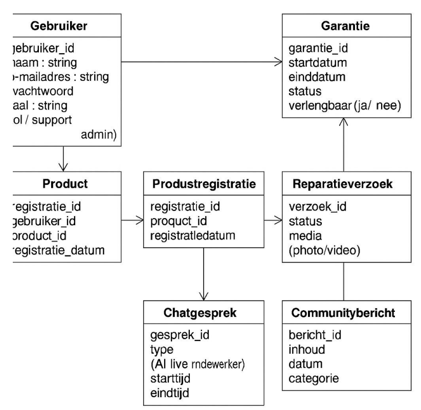

# Requirement Specificatie

## Telenova
**Clemens Eimermann**  
**Samir Sardar**  
**Usama Husnain**  
**Zakaria Ouzlig**  
**Rayaan Hohoud**

### Versienummer | Datum | Auteur | Wijziging | Gecontroleerd
- **0.1** | 11-04-2025 | Samir | Document aangemaakt + Organisatorische Context, Actoren en Bedrijfsprocesanalyse gemaakt | Clemens
- **0.2** | 11-04-2025 | Clemens | Productvisie en user stories gemaakt | Zakaria
- **0.3** | 11-04-2025 | Rayaan | Domeinmodel, UML klassendiagram, Sitemap en Wireframes toegevoegd | Usama

## Inhoud
1. **Organisatorische Context**  
2. **Actoren**  
3. **Bedrijfsprocesanalyse**  
4. **Productvisie (Product Vision Board)**  
5. **User Stories voor de Phoneventures App**  
6. **Domeinmodel**  
7. **UML Klassendiagram**  
8. **Sitemap**  
9. **Wireframe**

---

## 1. Organisatorische Context

### Missie
PhoneVentures wil de klanttevredenheid en klantloyaliteit verbeteren door digitale middelen te gebruiken.

### Visie
Het doel is om een gebruiksvriendelijke digitale omgeving te maken voor mensen die een smartphone hebben.

### Strategie
Door middel van een app wil PhoneVentures de klantenservice beter maken, meer producten verkopen en klanten beter bereiken via marketing.

### Doelstellingen
- Klanten moeten meer tevreden zijn
- Klanten blijven langer bij het bedrijf
- De klantenservice werkt efficiënter
- Meer verkoop van extra producten zoals accessoires

### Stakeholders
- Klanten van PhoneVentures
- Medewerkers van de klantenservice
- Het marketingteam
- Ontwikkelaars / IT-afdeling
- Het management van PhoneVentures

---

## 2. Actoren
- **Klant**: Kan producten registreren, handleidingen bekijken, vragen stellen en notificaties ontvangen via de app.
- **Klantenservice**: Helpt klanten bij vragen of problemen.
- **Technisch team**: Zorgt voor updates en lost technische problemen op.
- **Marketing**: Stuurt acties, aanbiedingen en promoties.
- **Beheerder**: Zorgt ervoor dat het systeem goed blijft werken en beheert de inhoud.

---

## 3. Bedrijfsprocesanalyse

### Huidige situatie (IST)
- Klanten nemen contact op via telefoon of e-mail.
- Veel tijd nodig om simpele vragen te beantwoorden.
- Klanten moeten zelf uitzoeken wat ze moeten doen.

### Gewenste situatie (SOLL)
- Klanten regelen alles zelf via de app.
- Minder druk op de klantenservice.
- Meer overzicht en gemak voor de klant.

### Problemen / Knelpunten
- Wachttijden zijn lang.
- Niet alle informatie is makkelijk vindbaar.
- Er zijn veel losse systemen in gebruik.

### Wat er nodig is (GAP)
- Alles centraliseren in één app.
- Selfservice toevoegen.
- Beter overzicht voor klant en medewerkers.

---

## 4. Productvisie (Product Vision Board)

### Doelgroep
Mensen die een smartphone gekocht hebben bij PhoneVentures.

### Wat willen ze?
Ze willen snel hulp, duidelijke productinformatie, software-updates en profiteren van acties.

### Wat is het product?
Een app waarin ze alles kunnen regelen: registratie, hulp, promoties, updates en community.

### Voordeel voor klanten
Ze besparen tijd en hoeven minder te bellen of mailen. Alles staat in één app, aangepast op hun situatie.

### Voordeel voor het bedrijf
Meer klantloyaliteit, lagere kosten door minder contactmomenten, en beter gebruik van klantgegevens voor marketing.

---

## 5. User Stories voor de Phoneventures App

### 1. Product Registreren
**User Story**:  
Als klant wil ik mijn smartphone makkelijk kunnen registreren zodat ik de garantie en info van mijn product kan zien.

**Wat moet er gebeuren**:  
Ik kan mijn telefoon registreren door een QR-code te scannen of ik kan het serienummer handmatig invullen, daarna zie ik mijn telefoon in mijn overzicht.

---

### 2. Garantie Melding
**User Story**:  
Als klant wil ik een bericht krijgen als mijn garantie bijna stopt zodat ik op tijd kan verlengen.

**Wat moet er gebeuren**:  
Ik krijg een melding 30 dagen voor mijn garantie eindigt en in de melding kan ik mijn garantie verlengen.

---

### 3. Handleidingen en Video’s Bekijken
**User Story**:  
Als klant wil ik mijn handleidingen en video’s kunnen bekijken voor mijn toestel zodat ik weet hoe het werkt.

**Wat moet er gebeuren**:  
Er is een pagina met handleidingen en video’s en ik kan zoeken op het onderwerp dat ik zoek.

---

### 4. Chatten met Klantenservice
**User Story**:  
Als klant wil ik met een medewerker kunnen chatten zodat ik snel geholpen word.

**Wat moet er gebeuren**:  
Ik kan chatten met een medewerker als het kantoor op is, de app helpt eerst met een chatbot voor simpele vragen.

---

### 5. Reparatie Melden
**User Story**:  
Als klant wil ik een reparatie kunnen melden en volgen in de app zodat ik weet wat er met mijn toestel gebeurt.

**Wat moet er gebeuren**:  
Ik stuur wat er gerepareerd moet worden in de app, dit doe ik door een foto of video te laten zien, ik krijg meldingen als de status verandert van mijn reparaties.

---

## 6. Domeinmodel

---

# 7. UML Klassendiagram

Het UML-klassendiagram laat zien hoe de verschillende onderdelen van de mobiele app van PhoneVentures met elkaar samenwerken. Je ziet welke gegevens er in het systeem staan en hoe die onderdelen met elkaar verbonden zijn. Het diagram geeft een duidelijk overzicht van:
- **Gebruikersbeheer** – bijvoorbeeld wie de gebruiker is, welke rol hij heeft en hoe hij inlogt.
- **Productregistratie** – welke producten een gebruiker heeft en wanneer ze zijn geregistreerd.
- **Chatgesprekken** – contact tussen gebruikers en medewerkers of een chatbot.
- **Reparatieverzoeken** – aanvragen voor hulp bij een kapot product.
- **Garantie-informatie** – of een product nog garantie heeft en of die verlengd kan worden.
- **Communityberichten** – berichten die gebruikers plaatsen om tips of vragen te delen.

Door dit diagram wordt het makkelijker om te begrijpen hoe de onderdelen van de app samenwerken. Zo moet een gebruiker bijvoorbeeld eerst een product registreren voordat hij een reparatieverzoek kan indienen. Ook zie je dat elke stap in het proces wordt vastgelegd in het systeem.

### Gebruiker
Dit is de persoon die het systeem gebruikt. Bijvoorbeeld een klant of een medewerker. Er staat informatie bij zoals:
- `gebruiker_id`: een uniek nummer voor de gebruiker
- `naam`: de naam van de gebruiker
- `e-mailadres`
- `wachtwoord`
- `taal`: de taal waarin de gebruiker het systeem wil gebruiken
- `rol`: of de gebruiker bijvoorbeeld klant of medewerker (support of admin) is

### Product
Dit zijn de spullen die een gebruiker heeft gekocht. Bij elk product staat:
- `registratie_id`: uniek nummer voor de registratie
- `gebruiker_id`: wie het product heeft gekocht
- `product_id`: welk product het is
- `registratie_datum`: wanneer het product is geregistreerd

### Productregistratie
Hier staat wanneer een product is aangemeld bij het systeem.
- `registratie_id`
- `product_id`
- `registratiedatum`

### Chatgesprek
Als een gebruiker contact opneemt met een medewerker of met een chatbot, komt dat hier te staan.
- `gesprek_id`
- `type`: bijvoorbeeld AI of een echte medewerker
- `starttijd` en `eindtijd`: wanneer het gesprek begon en eindigde

### Garantie
Dit geeft aan of het product garantie heeft.
- `garantie_id`
- `startdatum` en `einddatum`
- `status`: bijvoorbeeld actief of verlopen
- `verlengbaar`: kan de garantie verlengd worden? (ja of nee)

### Reparatieverzoek
Als een product kapot is, kan de gebruiker een reparatie aanvragen.
- `verzoek_id`
- `status`: bijvoorbeeld in behandeling of opgelost
- `media`: de gebruiker kan foto’s of video’s meesturen

### Communitybericht
Gebruikers kunnen berichten plaatsen in de community, bijvoorbeeld een vraag of een tip.
- `bericht_id`
- `inhoud`: de tekst van het bericht
- `datum`
- `categorie`: waar het bericht over gaat

### Hoe alles samenwerkt:
- Een gebruiker registreert een product
- Dat product krijgt een productregistratie
- De gebruiker kan via een chatgesprek hulp vragen
- Er kan ook een reparatieverzoek worden ingediend
- Voor dat verzoek kan er een garantie gelden
- En gebruikers kunnen ook actief zijn in de community

---

# 8. Sitemap

De sitemap toont de navigatiestructuur van een digitale omgeving, bijvoorbeeld een website of applicatie. Het hoofdmenu bestaat uit vijf hoofdcategorieën: Dashboard, Support, Community, Instellingen en Product registreren. Elke hoofdcategorie bevat één of meerdere subpagina’s die logisch zijn gegroepeerd op basis van functie en gebruiksgemak.

- **Dashboard** bevat persoonlijke informatie zoals geregistreerde producten, meldingen en aanbevelingen.
- **Support** biedt ondersteuning via een FAQ, tutorials, een chatbot of live chat en de mogelijkheid om een reparatieverzoek in te dienen.
- **Community** geeft toegang tot een forum en persoonlijke berichten, waar gebruikers met elkaar kunnen communiceren.
- **Instellingen** bevat opties om de taal, het thema en privacy- of meldingsvoorkeuren aan te passen.
- **Product registreren** is een afzonderlijke functie die direct vanuit het hoofdmenu te benaderen is.

Deze structuur zorgt ervoor dat gebruikers snel de juiste informatie of functie kunnen vinden. De visuele opzet maakt duidelijk hoe de verschillende onderdelen met elkaar samenhangen en draagt bij aan een gebruiksvriendelijke interface.

---

# 9. Wireframe

## Telefoon registreren

De afbeelding laat een webpagina zien die gebruikt wordt om een telefoon te registreren via een QR-code of via een handmatige invoer.

**Bovenkant van de pagina**  
Helemaal bovenaan zie je een logo met de tekst "Telefoon registratie". Rechts daarvan staat een menu met drie opties: Home, Scan QR Code en Handmatig invoeren. De optie Scan QR Code is groen gekleurd, dus dat is de pagina waar je op dat moment bent.

**Midden van de pagina**  
Er staat een koptekst die uitlegt dat je de QR-code op je product moet scannen met je telefoon. Op die manier voeg je het product toe aan je account. Daaronder staat een afbeelding van een telefoon die een QR-code scant.

**Onder het midden**  
Er verschijnt een melding dat de telefoon succesvol is geregistreerd. Dat betekent dat het toestel goed is toegevoegd aan je account. Je ziet ook een foto van het product, met daaronder de gegevens:
- Productnaam: Telefoon
- Model: 1
- Serienummer: 11111122222

**Onderaan de pagina**  
In de groene balk onderaan staat contactinformatie, zoals het e-mailadres `support@productregistration.com` en het telefoonnummer `+1234 567 890`. Aan de rechterkant vind je links naar de privacyverklaring en de algemene voorwaarden.

---

## Reparatieverzoek

De afbeelding laat een webpagina zien waar je een reparatieverzoek kunt indienen.

**Bovenkant van de pagina**  
Linksboven staat het logo met de tekst "Reparatie". Rechtsboven in het menu zie je drie opties:
- Reparatieverzoek indienen
- Reparatiestatus
- Instellingen

De gebruiker is op dit moment op de pagina "Reparatieverzoek indienen".

**Midden van de pagina**  
In het midden van de pagina staat een formulier waar je informatie kunt invullen. Het formulier bestaat uit drie delen:
1. **Beschrijf het probleem**: Hier kun je uitleggen wat er mis is met het apparaat of product.
2. **Upload een foto of video**: Je kunt hier een afbeelding of filmpje toevoegen van het probleem, zodat de reparatiedienst een beter beeld krijgt.
3. **Uw contactgegevens**: Hier vul je je e-mailadres of telefoonnummer in, zodat het bedrijf contact met je kan opnemen.

Onder het formulier staat een knop met de tekst "Verzoek indienen". Deze knop gebruik je om het formulier te versturen.

**Onderaan de pagina**  
Onder het formulier verschijnt een groene melding. In deze melding staat dat het reparatieverzoek succesvol is verstuurd. Het bedrijf laat weten dat ze binnenkort contact opnemen met de klant.

